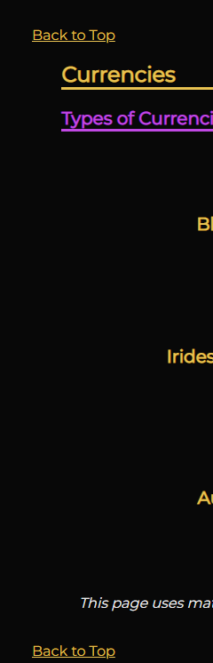

# DEAD BY DAYLIGHT
---

Dead by Daylight is a website dedicated to introducing both new and experienced games to the asymmetric multiplayer survival horror online game known as Dead by Daylight.

Our visitors can learn about the game, its history and mechanics. For those interested more in finer details, we have a section dedicated to characters, their perks and lore, as well as the game's most prominent items and currencies.

For any visual learner out there, we have currated a list of useful videos published by some of the most successful streamers.

If you, however, prefer to be on top of things at any time, we are happy to announce that you can subscribe to our newsletter.


## UX
---

Design was based on the Dead by Daylight color-scheme, combined with retro-futuristic elements inspired by the pluralism of the characters and their lore. 

As the accessibility is one of our imperatives, we have made sure to optimise the appearance of our website by leveraging icons and their positioning.

### Colour Scheme
---

Our colour scheme was inspired by the brand and the visual materials accompanied. 

Due to the nature of the game, darked colours take precedence. For this reason, we have opted to break the monotony by employing the in-game colours to create a user-friendly - and yet familiar - contrast.

-`#080808` used for primary background.\
-`#622D71` used for secondary background.\
-`#F0F1F2` used for primary and main heading text.\
-`#E8C252` used for primary highlights and secondary text.\
-`#199B1E` used for secondary hightlights and tertiary text.\
-`#C048E3` used for tertiary hightlights and quaternary text.

-`#FF8C00` used for additional text hightlights.\
-`#FF0000` used for additional text hightlights.

I used [colorkit.co](https://colorkit.co/palette/080808-622d71-e8c252-f0f1f2-199b1e-c048e3) to generate my colour palette.


I've used CSS `:root` variables to easily update the global colour scheme by changing only one value, instead of everywhere in the CSS file.

```css
:root {
    --black: rgba(8, 8, 8, 1);
    --white: rgba(240, 241, 242, 1);
    --purple: rgba(192, 72, 227, 1);
    --purple2: rgba(98, 45, 113, 1);
    --green: rgba(25, 155, 30, 1);
    --yellow: rgba(232, 194, 82, 1);
    --orange: rgba(255, 140, 0, 1);
    --red: rgba(255, 0, 0, 1);
}
```

### Typography

As Dead by Daylight mainly uses Montserrat, we have opted to remain true to the brand and adopted the font to be used throughout our website. This was done using Google Fonts.

To provide contrast to said font, Roboto was used in the secondary material - footer.

Roboto/Montserrat and sans-serif were also used as fallback fonts.

Font Awesome icons were added to provide the easy of navigation for our mobile users but were also kept in our desktop version to provide familiarity to our users.

In order to provide elegant experience, Favicon generator was used to provide tab icon to be used accross all of our pages.

- [Montserrat](https://fonts.google.com/specimen/Montserrat) was used for the primary headers, titles and text.

- [Roboto](https://fonts.google.com/specimen/Roboto) was used for all other secondary text.

- [Font Awesome](https://fontawesome.com) icons were used for page navigation.

- [Favicon generator](http://tools.dynamicdrive.com/favicon) was used to generate the tab icon.

## Wireframes

### Home Page Wireframes

| Size | Screenshot |
| --- | --- |
| Mobile |  |
| Tablet |  |
| Desktop |  |

### Streaming Wireframes

| Size | Screenshot |
| --- | --- |
| Mobile |  |
| Tablet |  |
| Desktop |  |

### Characters Page Wireframes

| Size | Screenshot |
| --- | --- |
| Desktop |  |

### Subscribe/Newsletter Page Wireframes

| Size | Screenshot |
| --- | --- |
| Desktop |  |

As is visible above, wireframes were used as an inspiration and the positioning was improved in production to better reflect the material.

## Features

### Existing Features

- **Navigation pane**

    - Horizontal navigation pane allows the user to always know where they are located and to easily navigate between multiple pages available. 


    - It is responsive, depending on the size of our user's screen. The icons chosen allow the user to still be aware of their location, regardless of the lack of wording describing the icons.


- **Iframes**

    - Iframes were added to our streaming page for 2 reasons - user can familiarise themselves with the most prominent streamers and at the same time learn about the vocabulary, tips and tricks. Videos chosen additionally boost our colour scheme it being on-brand.


    - In order to accomodate different screens our users might access our website on, iframes are set to change their positioning.

    

- **Subscription form**

    - Subscription form offers our users an opportunity to stay on top of the latest DBD news all while choosing the frequency of the emails.


- **Subscription confirmation**

    - Once our user is subscribed to our newsletter, they will receive a subscription confirmation. The page will take them to the index.html after 10 seconds.


- **Header**

    - Our header is simple - it consists of the official logo, page title and subtitle. The function of the subtitle is to convey to the user that this is their best place to familiarise themselves with the vast world of DBD.


- **Footer**

    - Our footer includes the links our average user would find useful - Dead by daylight's official website, Twitter and YouTube channel.


    - It is responsive, depending on the size of our user's screen. The icons chosen allow the user to still be aware of the intention, regardless of the lack of wording describing the icons.


- **Menu**

    - As our website is expected to grow with the addition of the new characters, we have included a menu in order for our user to easily choose which character or item they want to learn more about.


    - In order to stay true to the retro-futuristic design, our mobile version menu is reminiscent of the 'old-school' menus.


- **Back to top**

    - No one likes too much scrolling. Keeping the future growth of the brand in mind, we have included the 'Back to top' option to prevent any frustration for our users. The link will take the user back to the top of the page they are currently on.



- **Tab icon**  

    - Some days, you might feel like a tab collector. In order for our user to be able to always find that particular tab, we have ensured that all of our pages display a Dead by Daylight logo within the tab.


### Future Features

As always, there are some things that could be improved. Some of the future features include:

- Light theme
    - As our website is very dark, we would like to implement a light theme. In order to achieve that, we have already created variables for our colour scheme. This will speed us implementation of the feature in the future.
- Hamburger menu
    - Although we are content with the current state of our menu, we admit that a hamburger menu would be a more optimal option. As such, we plan to implement it in the future.


## Tools & Technologies Used

In order to reach the state our website is at, we have used different tools and/or technologies:

- [HTML](https://en.wikipedia.org/wiki/HTML) used for the main site content.
- [CSS](https://en.wikipedia.org/wiki/CSS) used for the main site design and layout.
- [CSS :root variables](https://www.w3schools.com/css/css3_variables.asp) used for reusable styles throughout the site.
- [CSS Flexbox](https://www.w3schools.com/css/css3_flexbox.asp) used for an enhanced responsive layout.
- [Git](https://git-scm.com) used for version control. (`git add`, `git commit`, `git push`)
- [GitHub](https://github.com) used for secure online code storage.
- [GitHub Pages](https://pages.github.com) used for hosting the deployed front-end site.
- [Gitpod](https://gitpod.io) used as a cloud-based IDE for development.
- [Favicon](http://tools.dynamicdrive.com/favicon) used to generate the tab icon.
- [YouTube](https://www.youtube.com) used to generate the iframe code.
- [Fontawesome](https://fontawesome.com) used to obtain icons featured within the navigation element.
- [TinyPNG](https://tinypng.com) used to compress images.
- [Convertio](https://convertio.co/png-webp) used to change image type.

## Testing

For all testing, please refer to the [TESTING.md](TESTING.md) file.

## Deployment

The site was deployed to GitHub Pages. The steps to deploy are as follows:
- In the [GitHub repository](https://github.com/josipcodes/dead-by-daylight), navigate to the Settings tab 
- From the source section drop-down menu, select the **Main** Branch, then click "Save".
- The page will be automatically refreshed with a detailed ribbon display to indicate the successful deployment.

The live link can be found [here](https://josipcodes.github.io/dead-by-daylight)

### Local Deployment

This project can be cloned or forked in order to make a local copy on your own system.

#### Cloning

You can clone the repository by following these steps:

1. Go to the [GitHub repository](https://github.com/josipcodes/dead-by-daylight) 
2. Locate the Code button above the list of files and click it 
3. Select if you prefer to clone using HTTPS, SSH, or GitHub CLI and click the copy button to copy the URL to your clipboard
4. Open Git Bash or Terminal
5. Change the current working directory to the one where you want the cloned directory
6. In your IDE Terminal, type the following command to clone my repository:
	- `git clone https://github.com/josipcodes/dead-by-daylight.git`
7. Press Enter to create your local clone.

Alternatively, if using Gitpod, you can click below to create your own workspace using this repository.

[](https://gitpod.io/#https://github.com/josipcodes/dead-by-daylight)

Please note that in order to directly open the project in Gitpod, you need to have the browser extension installed.
A tutorial on how to do that can be found [here](https://www.gitpod.io/docs/configure/user-settings/browser-extension).

#### Forking

By forking the GitHub Repository, we make a copy of the original repository on our GitHub account to view and/or make changes without affecting the original owner's repository.
You can fork this repository by using the following steps:

1. Log in to GitHub and locate the [GitHub Repository](https://github.com/josipcodes/dead-by-daylight)
2. At the top of the Repository (not top of page) just above the "Settings" Button on the menu, locate the "Fork" Button.
3. Once clicked, you should now have a copy of the original repository in your own GitHub account!

### Local VS Deployment

There are no difference between the deployed version and the development version.

## Credits

### Content

| Source | Location | Notes |
| --- | --- | --- |
| [Markdown Builder](https://traveltimn.github.io/markdown-builder) | README and TESTING | tool to help generate the Markdown files |
| [W3Schools](https://www.w3schools.com/css/css3_variables.asp) | entire site | how to use CSS :root variables |
| [Flexbox Froggy](https://flexboxfroggy.com/) | entire site | modern responsive layouts |
| [Alvarotrigo](https://alvarotrigo.com/blog/all-you-need-to-know-about-anchor-links) | entire site | how to create internal links |
| [Love Running](https://github.com/Code-Institute-Solutions/love-running-2.0-sourcecode/blob/main/02-creating-the-header/05-navigation-styling-2/index.html) | entire site | active class |
| [dev.to](https://dev.to/gathoni/how-to-make-font-awesome-icons-more-accessible-2m8) | entire site | how to create aria-label on Font Awesome icons |
| [Stack Overflow](https://stackoverflow.com/questions/1457563/equal-sized-table-cells-to-fill-the-entire-width-of-the-containing-table) | entire site | table management |
| [CSS Tricks](https://css-tricks.com/almanac/properties/a/aspect-ratio) | entire site | how to preserve iframe ratio |
| [Stack Overflow](https://stackoverflow.com/questions/18252356/what-is-the-difference-between-default-user-and-author-style-sheets) | entire site | what is user agent stylesheet |


### Media

| Source | Location | Type | Notes |
| --- | --- | --- | --- |
| [Dead by Daylight Fandom](https://deadbydaylight.fandom.com/wiki/Dead_by_Daylight_Wiki) | entire site | image, text | character images, their perks, items, entity claw image, character, item and perk descriptions. General presentation of the different levels of perks (text hightlights) was inspired by the Fandom presentation, however, no lines of code were copied. |
| [Dead by Daylight](https://deadbydaylight.com/media) | media gallery | image | large images across index, subscribe, subscribed and glossary pages |
| [Wikipedia](https://en.wikipedia.org/wiki/Dead_by_Daylight) | entire site | text | general info regarding Dead by Daylight |
| [Clipground](https://clipground.com) | gallery page | image | header Dead by Daylight logo |
| [Logos-world](https://logos-world.net/dead-by-daylight-logo) | gallery page | image | footer Dead by Daylight logo |
| [pngmart](https://www.pngmart.com) | gallery page | image | footer Twitter and Youtube images |
| [Youtube](https://www.youtube.com) | video page | video | iframe videos within streaming page |


### Acknowledgements

- I would like to thank my Code Institute mentor, [Tim Nelson](https://github.com/TravelTimN) for their support throughout the development of this project. Tim has also provided me with a refresh back to index.html code used on subscribed.html.
- I would like to thank the [Code Institute peer code review Slack community](https://code-institute-room.slack.com/archives/CGWQJQKC5) for allowing me to see what I should be striving for during the development of the website.
- I would like to thank Petra and Iva who lend me their ears when I was pacing through the house trying to figure out how to build a particular feature.