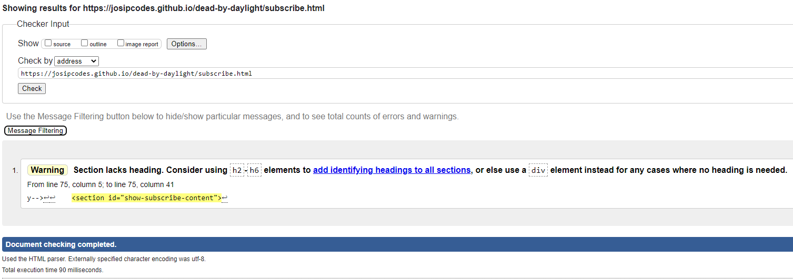
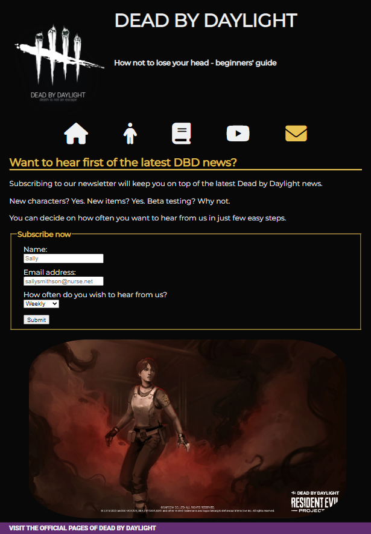
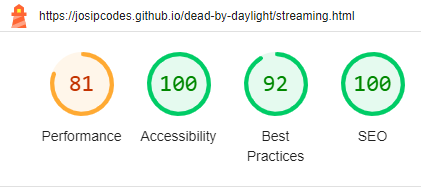

# Testing

Return back to the [README.md](README.md) file.

## Code Validation

### HTML

I have used the recommended [HTML W3C Validator](https://validator.w3.org) to validate all of my HTML files.

#### Initial state

| Page | Screenshot | Notes |
| --- | --- | --- |
| Home |  | Section lacks header h2-h6 warning |
| Characters |  | Section lacks header h2-h6 warning |
| Glossary |  | Section lacks header h2-h6 warning |
| Streaming |  | Section lacks header h2-h6 warning |
| Subscribe |  | Section lacks header h2-h6 warning |
| Subscribed |  | Section lacks header h2-h6 warning |

#### Troubleshooting 

| Page | Screenshot | Notes |
| --- | --- | --- |
| Home |  | Empty heading |

#### Final State 

| Page | W3C URL | Screenshot | Notes |
| --- | --- | --- | --- |
| Home | [W3C](https://validator.w3.org/nu/?doc=https%3A%2F%2Fjosipcodes.github.io%2Fdead-by-daylight%2Findex.html) |  | Pass: No Errors |
| Characters | [W3C](https://validator.w3.org/nu/?doc=https%3A%2F%2Fjosipcodes.github.io%2Fdead-by-daylight%2Fcharacters.html) |  | Pass: No Errors |
| Glossary | [W3C](https://validator.w3.org/nu/?doc=https%3A%2F%2Fjosipcodes.github.io%2Fdead-by-daylight%2Fglossary.html) |  | Pass: No Errors |
| Streaming | [W3C](https://validator.w3.org/nu/?doc=https%3A%2F%2Fjosipcodes.github.io%2Fdead-by-daylight%2Fstreaming.html) |  | Pass: No Errors |
| Subscribe | [W3C](https://validator.w3.org/nu/?doc=https%3A%2F%2Fjosipcodes.github.io%2Fdead-by-daylight%2Fsubscribe.html) |  | Pass: No Errors |
| Subscribed | [W3C](https://validator.w3.org/nu/?doc=https%3A%2F%2Fjosipcodes.github.io%2Fdead-by-daylight%2Fsubscribed.html) |  | Pass: No Errors |

### CSS

I have used the recommended [CSS Jigsaw Validator](https://jigsaw.w3.org/css-validator) to validate my CSS file.

| File | Jigsaw URL | Screenshot | Notes |
| --- | --- | --- | --- |
| style.css | [Jigsaw](https://jigsaw.w3.org/css-validator/validator?uri=https%3A%2F%2Fjosipcodes.github.io%2Fdead-by-daylight) |  | Pass: No Errors |

## Browser Compatibility

I've tested my deployed project on multiple browsers to check for compatibility issues.

| Browser | Screenshot | Notes |
| --- | --- | --- |
| Chrome |  | Works as expected |
| Firefox |  | Works as expected |
| Edge |  | Works as expected |
| Brave |  | Works as expected |
| Safari |  | Works as expected |
| Opera |  | Works as expected |

## Responsiveness

I've tested my deployed project on multiple devices to check for responsiveness issues.

| Device | Screenshot | Notes |
| --- | --- | --- |
| Mobile (DevTools) |  | Works as expected |
| Tablet (DevTools) |  | Works as expected |
| Desktop |  | Works as expected |
| iPad Air (DevTools) |  | Works as expected |
| iPhone SE (DevTools) |  | Works as expected |
| Samsung Galaxy s22 |  | Works as expected |

## Lighthouse Audit

I've tested my deployed project using the Lighthouse Audit tool to check for any major issues.

| Page | Size | Screenshot | Notes |
| --- | --- | --- | --- |
| Home | Mobile |  | Some minor warnings |
| Home | Desktop |  | Some minor warnings |
| Characters | Mobile |  | Some minor warnings |
| Characters | Desktop |  | Some minor warnings |
| Glossary | Mobile |  | Slower response time due to large images, cache policy, render-blocking resources |
| Glossary | Desktop |  | Slower response time due to large images, cache policy, render-blocking resources |
| Streaming | Mobile |  | Slower response time due to large images, cache policy, render-blocking resources |
| Streaming | Desktop |  | Slower response time due to large images, cache policy, render-blocking resources |
| Subscribe | Mobile |  | Slower response time due to large images |
| Subscribe | Desktop |  | Slower response time due to large images |
| Subscribed | Mobile |  | Auto-refresh impacting accessibility |
| Subscribed | Desktop |  | Auto-refresh impacting accessibility |

## Bugs

- Floating footer

    

    - To fix this, I needed to override user agent stylesheet.
```css
body {
    margin: 0 0;
}
```
- Inline button

    
    

    - To fix this, I needed to override user agent stylesheet by setting the display to block.
```css
body {
    display: block;
}
```

**Resolved Issues**

| Bug | Status |
| --- | --- |
| When validating HTML with a semantic `section` element, the validator warns about lacking a header `h2-h6`. | Closed after adding aria-label to the `h2-h6` elements. |
| Image size slows down the page loading time. | Closed after compressing images. |


**Open Issues**

None that I am aware of.

## Unfixed Bugs

| Bug | Reason for not resolving |
| --- | --- |
| Nav elements span over two lines on devices smaller than ~ 300px in width | Low chances of the user encountering this issue. |
| Header styling creates overflow-x issue on devices smalle than ~ 300px in width. | Low chances of the user encountering this issue. |

